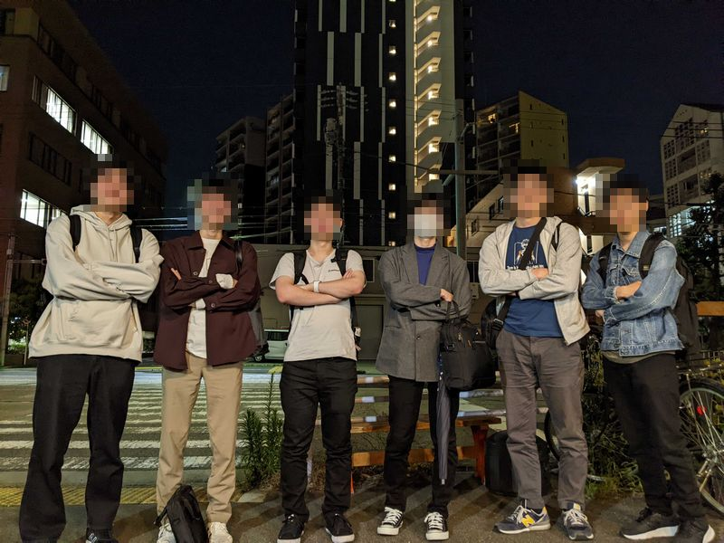
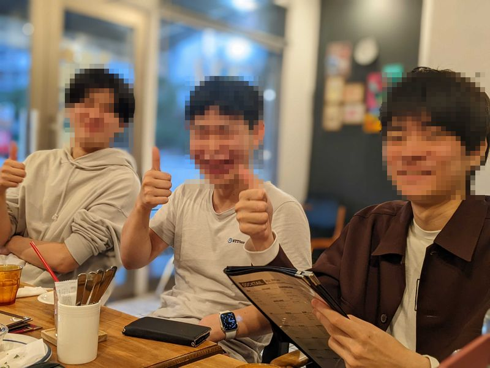
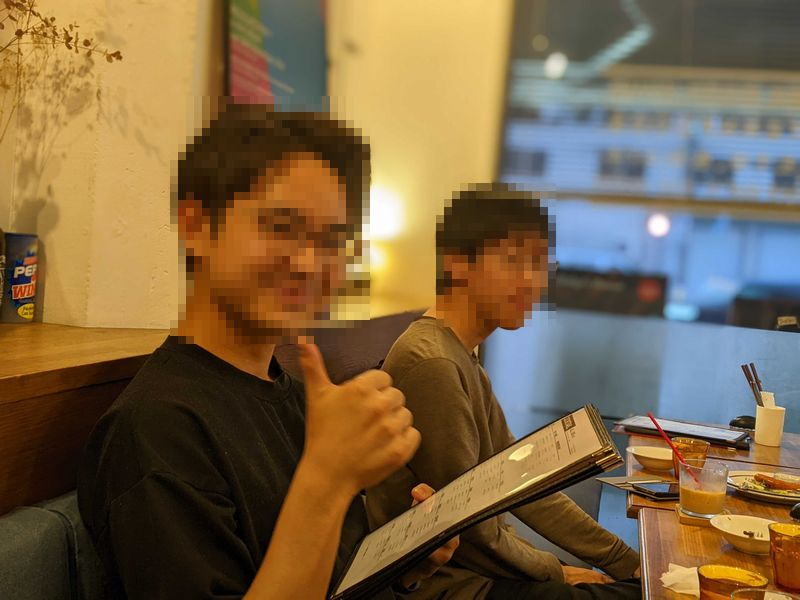
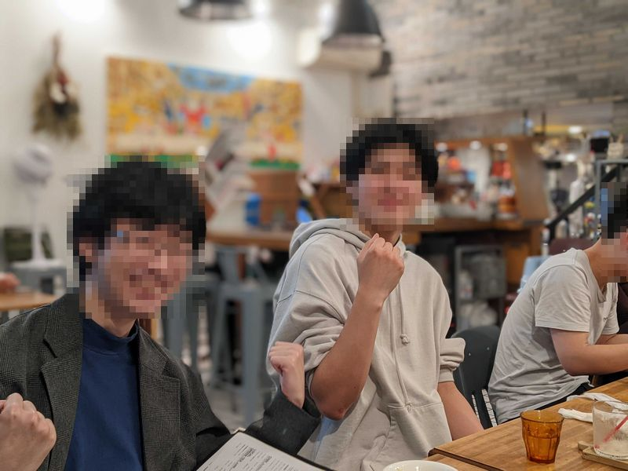
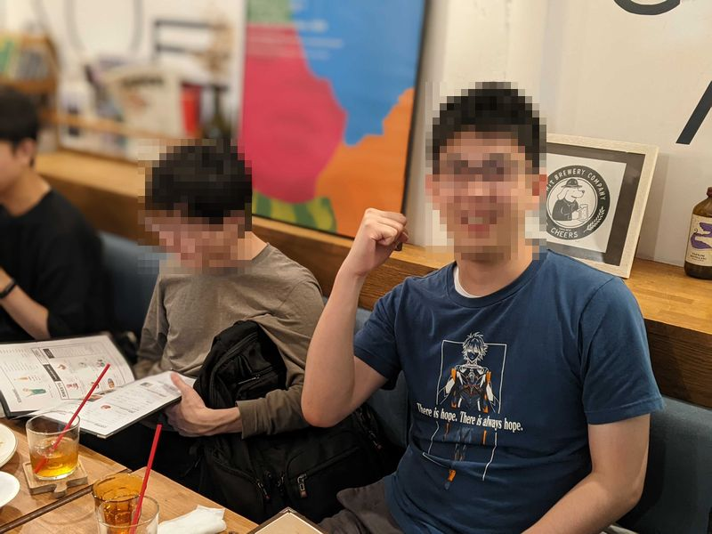

2023年5月16日 OneScope 名古屋メンバーが集結しました。

場所は [WitCAFE](https://tabelog.com/aichi/A2301/A230105/23059328/) です。  
WitCAFE は鶴舞駅から徒歩5分、WiFi が使えるオシャレなカフェです。  
遠方メンバーとは Discord をつなぎ、リモートで参加してもらいました。

今回は OneScope として、コンテンツをどう増やしていくかを話し合いました。  
漠然とアイディアを出すのでなく、目的を共有したうえで考え議論ができるので、有意義な時間となりました。
- 技術記事の配信方法
  - ブログと同じように Hugo で静的サイトとして配信する
  - GitHub Wiki でより気軽に編集しやすいようにする
- どうすると記事を書きやすいか
  - タイトルが先に決まっていて、記事の中身を分担して埋めていく
  - テンプレートがあったほうがよい
- 記事内容について
  - たとえばただ NumPy の使い方を紹介するではなく、画像処理と絡めてより実務に近い形式で紹介する
- ランディングページを充実させていく
  - 所属しているメンバーを紹介する
  - 過去に行った実務を紹介する

また雑談としては、次のようなトピックがありました。
- 最近話題のプログラミング言語 Mojo の可能性について
- 実務での Wasm の活用について

以下、交流会の様子です。

