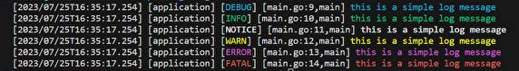

## 構造化ログとは
一般的にログというと、以下のような文字列によるログ（テキストログ）が想起されると思います。
```
[error]: No such file or directory
```
これに対し構造化ログとは、jsonあるいはその他の形式で構造化されたログです。以下に簡単な例を示します。
```
{
  "time": "2023-07-26T00:00:00.00000+09:00",
  "level": "ERROR",
  "msg": "No such file or directory",
  "id": 10937846
}
```
構造化ログは、テキストログよりも詳細な情報を含めることで、ログレベルを分けたりログの検索を容易にすることができます。  
CLIなどのシンプルなツールであればテキストログで十分なこともありますが、クラウドサービスのバックエンドなどではこうした構造化ログの性質は実質必須なものになります。

## slogパッケージ
従来のGoではlogパッケージが公式のロガーとして使われてきましたが、上記のような構造化ログをうまく扱うことはできませんでした。 
slogパッケージは構造化ログを扱うことができ、以前から公式のロガーとして導入が検討されてきており、Go1.21で導入予定となりました。

### テキストログを出力する
まずはテキストログを出力してみます。  
slogではログレベルが分かれており、それぞれメソッドが存在します。
```go
	slog.Debug("this is a simple log message")
	slog.Info("this is a simple log message")
	slog.Notice("this is a simple log message")
	slog.Warn("this is a simple log message")
	slog.Error("this is a simple log message")
	slog.Fatal("this is a simple log message")
```

output  



実際にターミナルで出力してみると、画像のようにデフォルトでログレベルごとに綺麗に色分けがされており非常に見やすくなっています。

### json形式のログを出力する
続いて、json形式の構造化ログを出力してみます。以下は最もシンプルな例です。
```go
	slog.SetFormatter(slog.NewJSONFormatter())

	slog.Info("this is a structured log message")
```

output（以下、json形式の出力はフォーマット済み。実際には改行なしで出力される）
```
{
  "caller":"main.go:10,main",
  "channel":"application",
  "data":null,
  "datetime":"2023/07/26T00:00:00.080",
  "extra":null,
  "level":"INFO",
  "message":"this is a structured log message"
}
```

ログに新たにフィールドを追加したい時は `WithField` 関数が使えます。引数には追加するキーと値を指定します。
```go
    slog.SetFormatter(slog.NewJSONFormatter())

	json_log_with_fields := slog.WithField("category", "service")
	json_log_with_fields.Info("this is a structured log message with fields")
```
output
```
{
  "caller":"main.go:14,main",
  "category":"service",   // 追加されたフィールド
  "channel":"application",
  "data":{},
  "datetime":"2023/07/26T00:00:00.000",
  "extra":{},
  "level":"INFO",
  "message":"this is a structured log message"
}
```

また、`WithFields` 関数を使うことで一度に複数のフィールドを登録することもできます。
```go
    slog.SetFormatter(slog.NewJSONFormatter())

	json_log_with_fields := slog.WithFields(slog.M{
		"category": "service",
		"IP":       "127.0.0.1",
	})
	json_log_with_fields.Info("this is a structured log message with fields")
```
output
```
{
  "IP":"127.0.0.1",   // 追加されたフィールド
  "caller":"main.go:14,main",
  "category":"service",   // 追加されたフィールド
  "channel":"application",
  "data":{},
  "datetime":"2023/07/26T00:00:00.000",
  "extra":{},
  "level":"INFO",
  "message":"this is a structured log message"
}
```
### その他の機能
slogパッケージではこのほかに、ログに出力する値を出力前にチェックして書き換えたり、出力形式自体を自作するためのインターフェースも用意されています。これらを用いることで、ログに出力したくない情報を除外したり、ログを自由に整形したりするなど、柔軟なロギングが実現可能です。
