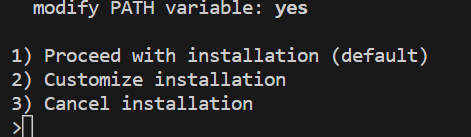
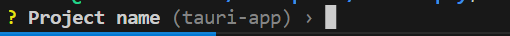
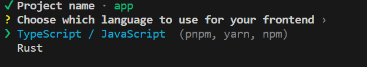
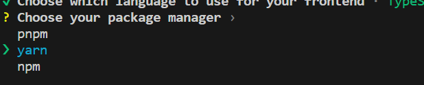
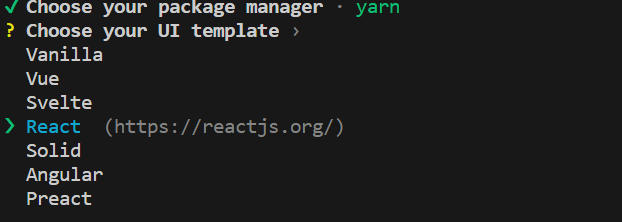

## 実行環境
- WSL2
- ubuntu 22.04

## Rustのインストール
ターミナルで以下のコマンドを実行します。
```
curl --proto '=https' --tlsv1.2 -sSf https://sh.rustup.rs | sh
```
実行後に選択を求められるので、1を選択します。



実行が完了したら、以下のコマンドで一度ターミナルを再起動します。
```
exec $SHELL -l
```

これで`rustc`コマンドが実行できるようになったはずです。確認してみましょう。
```
> rustc --version
rustc 1.71.1 (eb26296b5 2023-08-03)
```

## Tauriのインストール
先ほどRustとともにインストールしたRustのパッケージマネージャーcargoを使って、以下のコマンドでインストールできます。
```
cargo install create-tauri-app
```

インストールしたら、早速プロジェクトを作成してみましょう。
```
cargo create-tauri-app
```

上記のコマンドを実行すると、まずプロジェクト名を求められます。



プロジェクト名を入力したら、次はフロントエンドに使用する言語を聞かれます。今回は`Typescript/Javascript`を選択します。



次に、パッケージマネージャーを選択します。`npm` は少し重いので `yarn` を選択します。



最後に、UIテンプレートを選択します。今回は `React` > `Typescript` を選択します。



UIテンプレートの選択までが完了すると、先ほど指定したプロジェクト名のディレクトリの中に、テンプレートが作成されていることが確認できるかと思います。

## yarnのインストール
※（必要ない方は読み飛ばしてください）  

先ほどパッケージマネージャーとして指定したyarnをインストールしておきます。
```
curl https://dl.yarnpkg.com/debian/pubkey.gpg | sudo apt-key add -
echo "deb https://dl.yarnpkg.com/debian/ stable main" | sudo tee /etc/apt/sources.list.d/yarn.list
sudo apt update
sudo apt install yarn
```

